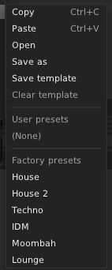

# Module Presets



Factory module presets are a great tool for teaching and inspiring users of your Rack plugin.
They store parameter values, as well as internal data from your `Module::dataToJson()` method if overridden.
Since presets are simply JSON files, they cannot store module patch storage files (introduced in Rack 2).

To include a factory module preset in your module, save a module preset file (`.vcvm`) to
```txt
<your plugin's root dir>/presets/<module slug>/<preset name>.vcvm
```
and add the `presets` directory to your distributables.
```makefile
DISTRIBUTABLES += presets
```
Rack reloads presets when the user opens the preset context menu, so you do not need to restart Rack.

Module presets are sorted alphabetically by filename.
However, (since Rack 2) if a filename begins with numerical digits followed by `_` (regex `/^\d+_/`), that prefix is not displayed to the user, so you can apply your own custom preset sorting order.
For example, the presets from [VCV Drum Machine](https://library.vcvrack.com/VCV-Drums/DrumMachine) (pictured) use the following filenames.
```txt
/presets/DrumMachine/00_House.vcvm
/presets/DrumMachine/01_House 2.vcvm
/presets/DrumMachine/02_Techno.vcvm
/presets/DrumMachine/03_IDM.vcvm
/presets/DrumMachine/04_Moombah.vcvm
/presets/DrumMachine/05_Lounge.vcvm
```

Presets can be edited with a text editor to update only a subset of parameters.
For example, to change parameters #0 and #2 but leave #1 unchanged, remove the `"param"` object with `id` 1.
```json
  "params": [
    {
      "id": 0,
      "value": 0.5
    },
    {
      "id": 2,
      "value": 1.0
    }
  ]
```
